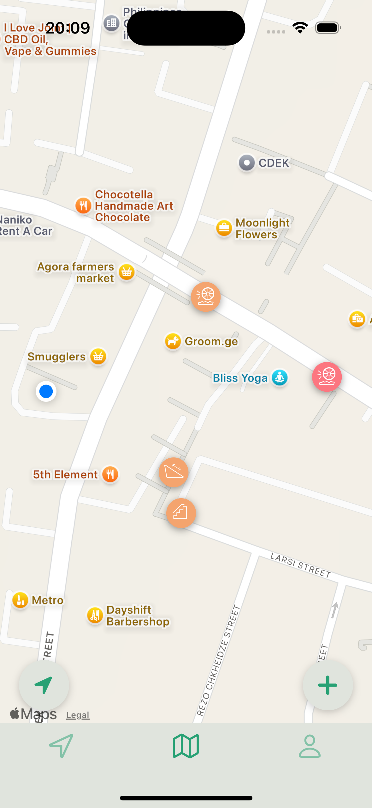
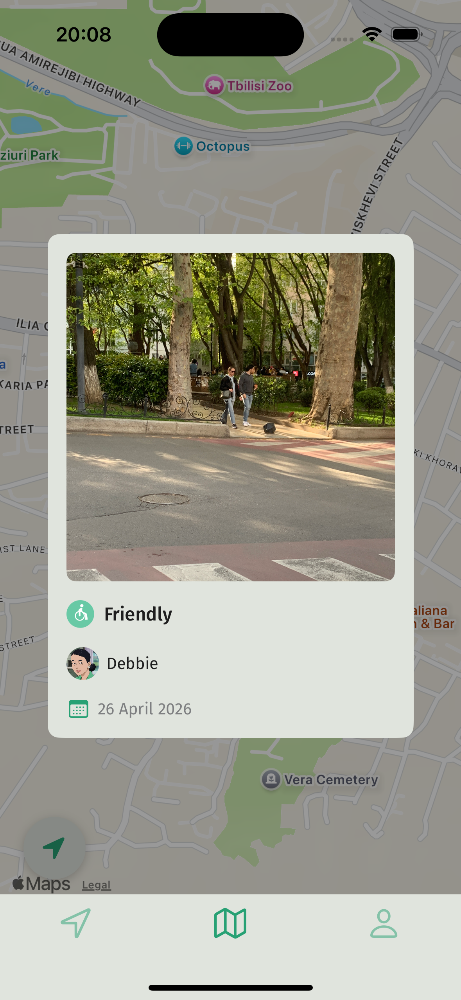
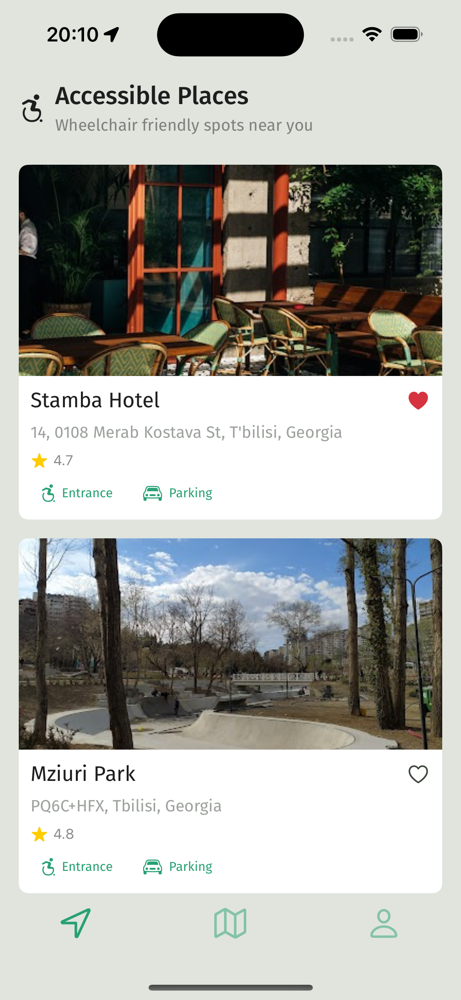
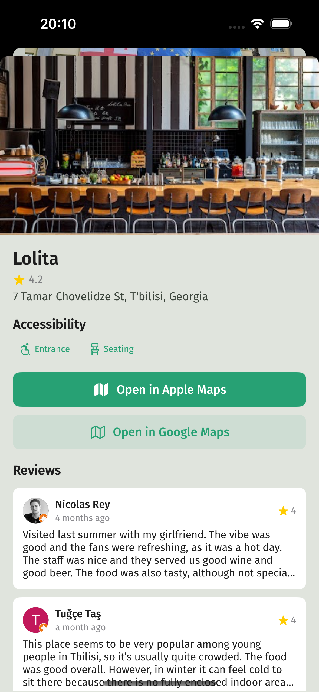
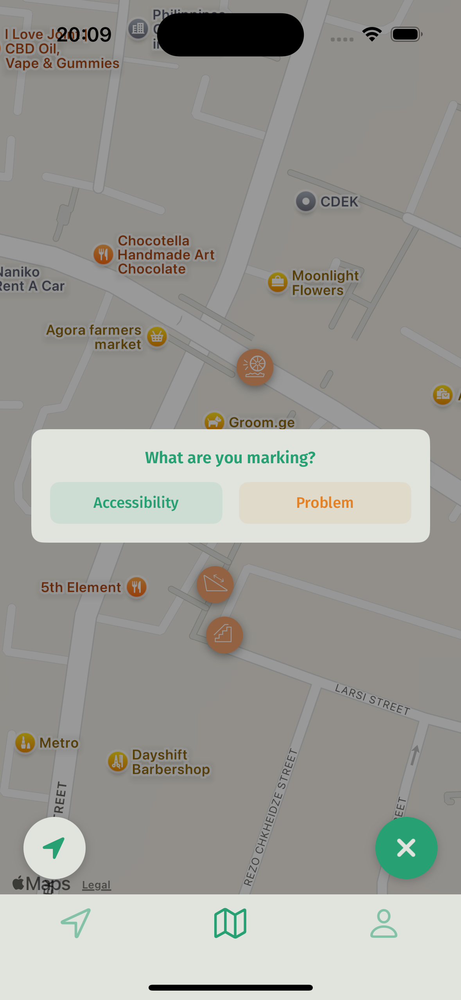
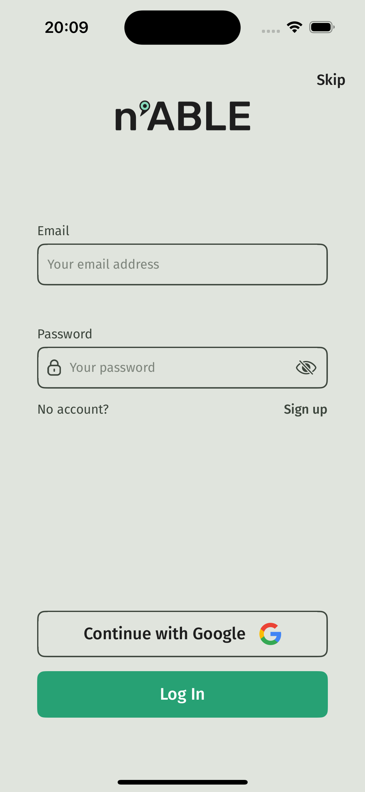
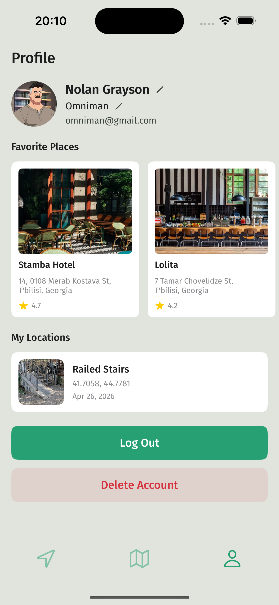
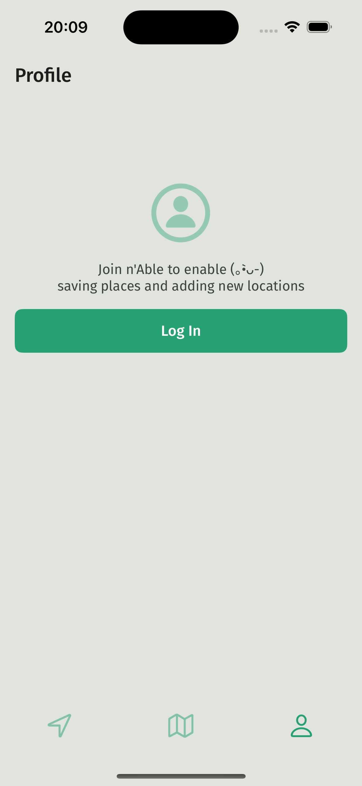

# nAble

## About 

n'Able is an iOS application created to make cities more navigable for people with limited mobility. The application was built to help users share and discover accessibility information in their surroundings, through a map where anyone can mark locations with accessibility icons and photos for others to see. Alongside the community-driven map, n'Able surfaces nearby wheelchair-friendly places powered by the Google Places API, updated dynamically as the user moves. The data is crowdsourced, a model proven to work at scale, and over time builds a trustworthy database for wheelchair users, people on crutches, parents with strollers, and anyone else who needs to plan their route with accessibility in mind.

## Target Audience

- People with limited mobility, wheelchair users, crutch users, people with strollers etc.

## Features

- **Interactive Map** - Real time location, ability to add and see others' accessibility markers with photos
- **Nearby Places** - Dynamic list of wheelchair-friendly places powered by Google Places API, updated every 50 meters
- **Location Logging** - Adding accessibility markers with type icons and optional photos
- **Location Details** - Tap any marker to see the photo, type, who added it and when
- **Place Details** - View place info, accessibility options, reviews and open in Apple or Google Maps
- **Account Management** - Profile customization, avatar, username and full name editing, favorite places, added locations, account deletion
- **Guest Mode** - Browse the map and places without an account
- **Google Sign In** - Quick authentication via Google
- **Dark Mode Support** - System based theme

## Screenshots

  
  
  
  

  
  
  
  

## Technologies Used

- **Swift** - Primary programming language
- **UIKit** - Core UI framework, viewcontrollers
- **SwiftUI** - UI components and views
- **MapKit** - Interactive map display and location services
- **Core Location** - GPS and location tracking
- **Firebase Authentication** - Secure user login and account management
- **Firebase Firestore** - Real-time database for storing users and locations
- **Firebase Storage** - Cloud storage for images added by users

## Architecture 

Built using **MVVM + Clean Architecture** for maintainable, testable code with clear separation between UI, business logic, and data layers.

## Requirements

- **Deployment Target** - iOS 18.6
- **Xcode Version** - 16.3
- **Device** - iOS only
- **Permissions** - Location access, photos access
- **Internet Connection** - Required for Firebase and Google Places API

## Installation

1. Clone the repository
2. Open the project in Xcode
3. The app uses a shared Firebase database - the `GoogleService-Info.plist` file is included
4. Build and run (⌘ + R)

## Author

Elene Dgebuadze
